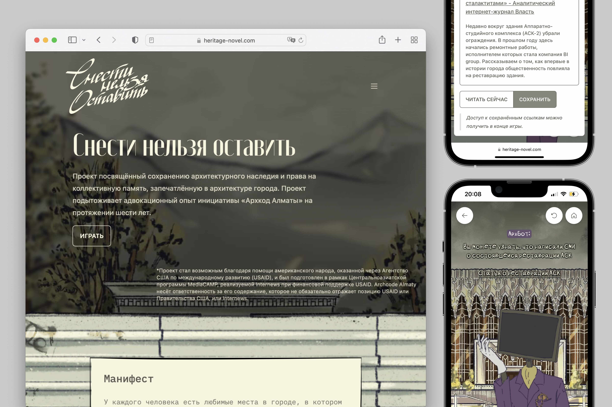

# archcode-heritage-novel

Snesti nelʹzâ ostavitʹ is a visual novel-like interactive experience. For [Archcode Almaty](https://archcode.kz/).

Powered by [Next.js](https://nextjs.org/), [react-visual-novel](https://github.com/utility-first/react-visual-novel), [Tailwind CSS](https://tailwindcss.com/), and [Framer Motion](https://www.framer.com/motion/).

## License

[MIT License](./LICENSE) © Archcode Almaty
