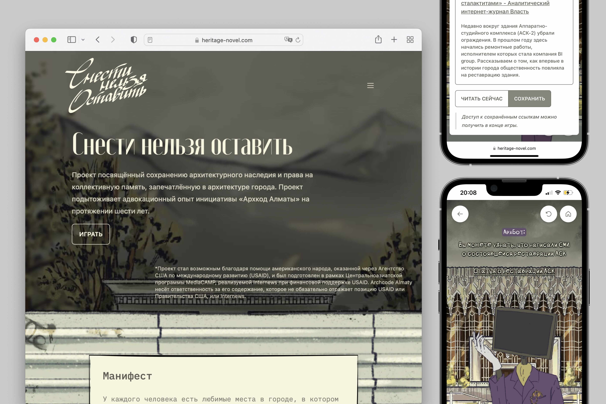

# Снести нельзя оставить

[](https://vercel.com/yenbekbay/archcode-heritage-novel) [](/LICENSE)

«Снести нельзя оставить» is a Russian-language editorial website and interactive visual novel about Almaty architectural heritage and collective memory. It was created for [Archcode Almaty](https://archcode.kz/).

The repository contains the Next.js 16.3 App Router website with Tailwind CSS 4 and React Aria controls, server-rendered editorial routes, the browser-run `react-visual-novel` story and assets under `src/`, optional Supabase and Imgflip participation flows, generated source artifacts, and the living product, architecture, UI-design, capability, and setup contracts.



## Start

```sh
mise install
pnpm install
umask 077
mise exec -- fnox export --if-missing error --output .env.local
chmod 600 .env.local
pnpm run dev
```

## Documentation

- [Product](docs/product.md) defines the purpose, audience, shared vocabulary, product surfaces, and acceptance.
- [Architecture](docs/architecture.md) maps routes, runtime ownership, generated artifacts, provider boundaries, and failure behavior.
- [UI design](docs/ui-design.md) defines the editorial and game presentation grammar.
- [Visual novel](docs/specs/visual-novel.md) defines playable roles, progression, saved links, optional submissions, and game states.
- [Local setup](docs/runbooks/local-setup.md) covers toolchain preparation, environment recovery, and the local smoke check.

## License

[GPL-3.0 License](./LICENSE) © Archcode Almaty
